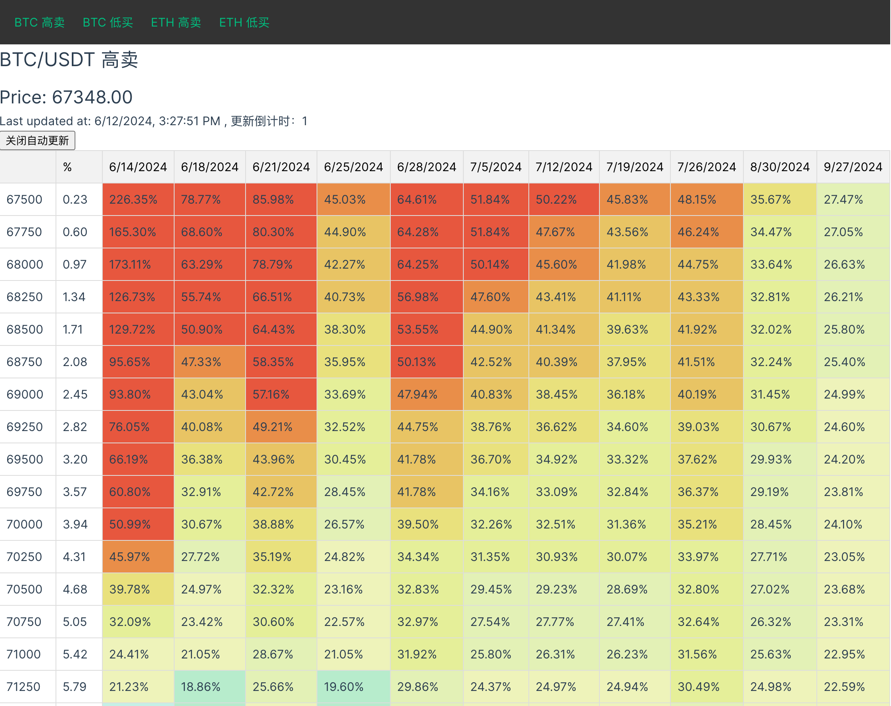

这是一个获取币安双币投资收益率的程序。  
This is a program for obtaining the yield rate of Binance dual-currency investments.

# build front  VUE
``` shell
cd *front && npm run build
```

# create .env file
``` shell
BN_KEY="key"
BN_SECRET="sec"
```

# start server FastAPI
``` shell
# dev mode
uvicorn server.svr:app  --reload
```

# ScreenShot

